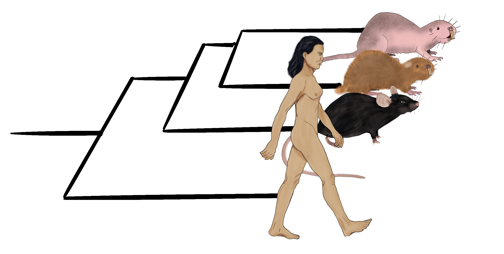

## The Computational and Molecular Prevention lab @ DKFZ
The Computational and Molecular Prevention group uses big data omics to develop a quantitative mechanistic understanding of normal tissue ageing and early carcinogenesis with the ultimate aim of defining novel strategies for prevention and early detection of epithelial cancers.

To date, concepts from established tumours, such as “driver” mutations or tumour expression markers, have not translated into useful biomarkers for prevention, but there are exciting opportunities to revolutionise the approach to pre-invasive disease by applying knowledge of its molecular characteristics. The unique proposition of the group is to perform extensive longitudinal and spatial sampling of normally ageing and pre-malignant tissue biopsies from cancer- sensitive and cancer-resistant animal models and humans, to provide insight into premalignant evolutionary trajectories and predict the occurrence, pace, and prognosis of a future malignancy.

## Current projects
We are developing multiple projects that combine deep DNA and single-cell sequencing, spatial transcriptomics with functional analysis and comparative genomics with the goal of understanding how the perturbation of genetic sequences can lead to the development of tumours. We also develop computational methods for novel technologies.

### Comparative genomics of carcinogenesis

	

        
      	

      	

Why do some organisms, including many humans, never develop cancer in their lifetime? To address this question, we are studying model organisms with high natural cancer resistance and exceptional longevity such as the naked mole-rat and Ansell’s mole-rat.
      	

### How the biological clock ticks in the female reproductive tract
In humans, the female reproductive system plays a significant role in shaping life- and health- span. In our group we functionally model homeostasis and dysregulation of the female reproductive tract over ageing and upon hormonal perturbation in mouse models and in human, using high-throughput sequencing of single-cell experiments.

<video width="100%" height="auto" controls>
  <source src="{{ '/img/super_ov.mp4' | relative_url }}" type="video/mp4">
  Your browser does not support the video tag.
</video>

### Digital prevention

The digital prevention group within the National Cancer Prevention Center (NCPC) aims to expand our activities in prevention through the development of publicly available personalised cancer risk calculators. The group has close links with the DKFZ epidemiology units and straddles the subjects of public health, science/risk communication and software engineering.

